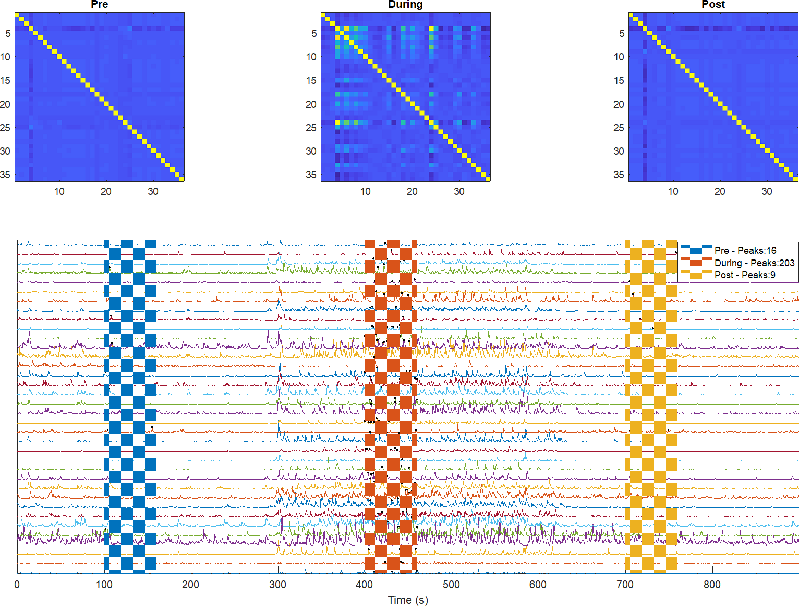

# Miniscope Analisis
Script to process miniscope data and quantify activity (e.g. spontaneous peaks and correlations) on arbitrary epoch definitions.


## Install
* Download and install [MATLAB][MATLAB].
* Download and extract source files to `Documents/MATLAB`

## Analyze
* Set the variables within the script to match your data files.
* Define epochs.
* Change settings and thresholds to compute peaks and clusters.
* Click `Run` or execute section by section.

Epochs consists of labeled arrays of timestamps (s) and share a common window size.
For example,
```MATLAB
  epochs = {'A', 100, 'B', [200 2000], 'C', 300};
  windowSize = 10;
```
Means there are three epochs called A, B, and C:
```
A: 100 to 110
B: 200 to 210 and 2000 to 2010
C: 300 to 310
```

## Outputs
* Plots: Raster and cross-correlation
* CSV file: Peak counts for each cell in each epoch; filename and location matching that of the data file.

## License
© 2019 [Leonardo Molina][Leonardo Molina]

This project is licensed under the [GNU GPLv3 License][License].

[Leonardo Molina]: https://github.com/leomol
[MATLAB]: https://www.mathworks.com/downloads/
[License]: LICENSE.md